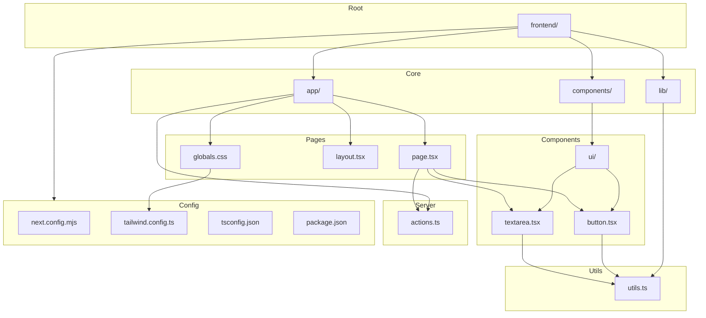

```mermaid
graph TD
    subgraph Root
        A[frontend/]
    end

    subgraph Core
        B[app/]
        C[components/]
        D[lib/]
    end

    subgraph Pages
        E[page.tsx]
        F[layout.tsx]
        G[globals.css]
    end

    subgraph Components
        H[ui/]
        I[button.tsx]
        J[textarea.tsx]
    end

    subgraph Server
        K[actions.ts]
    end

    subgraph Utils
        L[utils.ts]
    end

    subgraph Config
        M[next.config.mjs]
        N[tailwind.config.ts]
        O[tsconfig.json]
        P[package.json]
    end

    %% 関係性
    A --> B
    A --> C
    A --> D
    A --> Config

    B --> E
    B --> F
    B --> G
    B --> K

    C --> H
    H --> I
    H --> J

    D --> L

    %% コンポーネントの依存関係
    E --> I
    E --> J
    E --> K

    I --> L
    J --> L

    %% スタイリングの依存関係
    G --> N
```